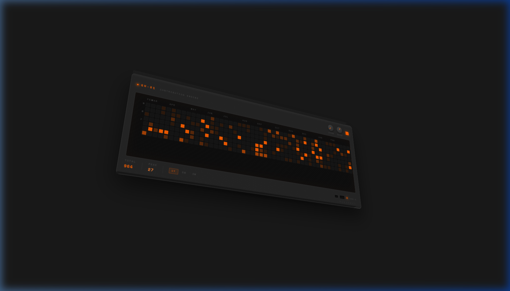

<div align="center">

# S P A L D I N G
### UNIT: CT-01 │ REV: 2026.02 │ SERIAL: IE-DUB-001

[](https://x.com/james__spalding)
[](https://jamesspalding.org)
[](https://resume-iamai.vercel.app/)


</div>

---



---

```text
╔══════════════════════════════════════════════════════════════════════╗
║  ACTIVE MODULES                                              CT-01   ║
╠══════════════════════════════════════════════════════════════════════╣
║                                                                      ║
║   [00] JamesOS Portfolio       145-page iOS Core. 52 themes.         ║
║   [01] Unbreakable Pipeline    Beat-synced animation. Remotion.      ║
║   [02] NickOS AAC System       323-phrase sensory/learning games.    ║
║   [03] Lynkr Local AI Proxy    Ollama + Whisper via CF Tunnel.       ║
║   [04] Voice Call Infra        Real-time LiveKit conversations.      ║
║   [05] Social Automation       AI-drafted scheduling (Postiz).       ║
║   [06] Discovery Agent         Twilio → Deepgram → AI James.         ║
║   [07] Vibe Picker             Design system URL extractor.          ║
║   [08] ACE-Step Music Gen      Local commercial music engine.        ║
║   [09] Dogfood QA System       Agent-browser systematic testing.     ║
║                                                                      ║
╚══════════════════════════════════════════════════════════════════════╝
```

```text
╔══════════════════════════════════════════════════════════════════════╗
║  SYSTEM SPECS [PORTFOLIO CORE]                               v2.6    ║
╠══════════════════════════════════════════════════════════════════════╣
║                                                                      ║
║   PAGES: 145 unique routes      CONVEX: 114 production tables        ║
║   APPS:  64 top-level dirs      AI TOOLS: 121 tool definitions       ║
║   THEMES: 52 dynamic skins      HOOKS: 41 custom primitives          ║
║                                                                      ║
║   BASE     Next.js 16 · React 19 · Convex · TypeScript              ║
║   MEDIA    Remotion · ComfyUI · Fal AI · LiveKit                    ║
║   AI       Ollama · Anthropic · Deepgram · 1536-dim Vector           ║
║                                                                      ║
║   FREQ ▰▰▰▰▰▰▰▰▰▱  GAIN ▰▰▰▰▰▰▰▱▱▱                                  ║
║                                                                      ║
╚══════════════════════════════════════════════════════════════════════╝
```

---

<div align="center">

### `CONTRIBUTION ENGINE LOG`


</div>

---

```text
╔══════════════════════════════════════════════════════════════════════╗
║  TECHNICAL LOG ENTRIES                                        [IO]   ║
╠══════════════════════════════════════════════════════════════════════╣
║                                                                      ║
║   [2026-02-24] 145 pages. 52 themes. 121 AI tools. 114 Convex        ║
║                tables. If this is "just a resume," then a            ║
║                Swiss Army knife is "just a knife."                   ║
║                                                                      ║
║   [2026-02-24] SchoolTube Deployed. 30+ games for autism sensory     ║
║                learning. Sensory play to production loop closed.     ║
║                                                                      ║
║   [2026-02-08] Unbreakable Episode 1 Pipeline. Beat analysis to      ║
║                Remotion assembly complete. Professional output.      ║
║                                                                      ║
╚══════════════════════════════════════════════════════════════════════╝
```

---

```text
╔══════════════════════════════════════════════════════════════════════╗
║  AI JAMES [THE DIGITAL TWIN]                                  O/C/V  ║
╠══════════════════════════════════════════════════════════════════════╣
║                                                                      ║
║   PERSONALITY: Irish creative technologist | non-corporate           ║
║   TOOLS: 121 callable browser/system functions                       ║
║   MEMORY: Recursive Episodic + Semantic Layer                        ║
║   VOICE: ElevenLabs + OpenAI (Full STT/TTS Pipeline)                 ║
║   ACCESS: Multi-tier (Owner / Collaborator / Visitor)                ║
║                                                                      ║
║   ┌─USB-C─┐  ┌─MIDI─┐  ┌─SYNC─┐  ● PWR                               ║
║   └───────┘  └──────┘  └──────┘                                      ║
║                                                                      ║
╚══════════════════════════════════════════════════════════════════════╝
```

<div align="center">

```text
╔══════════════════════════════════════╗
║                                      ║
║  "12 agents. One recursive loop.     ║
║   The system maintains itself."      ║
║                                      ║
║  PODJAMZ™  ·  2026                   ║
║                                      ║
╚══════════════════════════════════════╝
```

</div>
